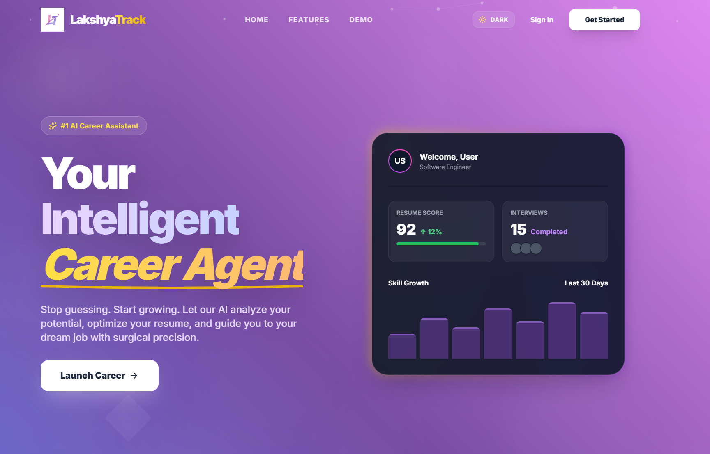
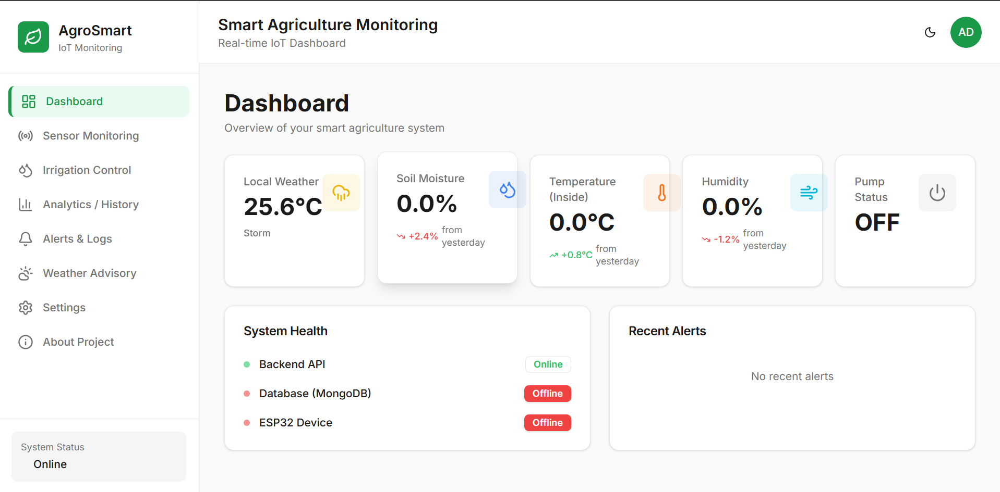
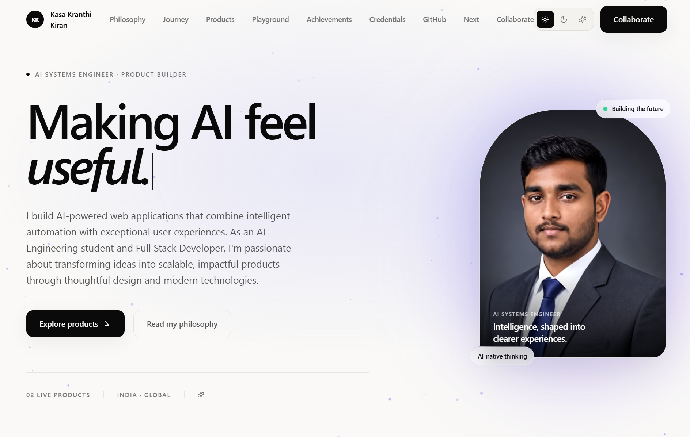
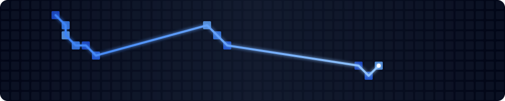

  <picture>
    
  </picture>

  

    
    
    
    
  

 

  <picture>
    
  </picture>

<h2 align="center">About</h2>

  

    I'm an AI Engineer and Full Stack Developer passionate about turning complex machine learning research into products people actually use. My work spans computer vision, intelligent automation, and scalable web platforms — always with a focus on shipping production-ready software, not just prototypes.
  

   
  

    I believe the best engineering happens at the intersection of deep technical skill and genuine product thinking. Every project I build solves a real problem — from helping students plan their careers with AI, to enabling farmers to monitor crops through IoT, to making communication more accessible through sign language translation.
  

 

  <picture>
    
  </picture>

<h2 align="center">Engineering Command Center</h2>

  
<i>Automatically updated every 6 hours via GitHub Actions &middot; August 16, 2026</i>

  <picture>
    
  </picture>

 

  <picture>
    
  </picture>

<h2 align="center">Currently Building</h2>

  

    <picture></picture>
    <picture></picture>
    <picture></picture>
    <picture></picture>
    <picture></picture>
  

 

  <picture>
    
  </picture>

<h2 align="center">Flagship Projects</h2>

 

<!-- ━━━━━━━━ LakshyaTrack ━━━━━━━━ -->

  <picture>
    
  </picture>
    
  <picture></picture>
    
  <h3>LakshyaTrack</h3>
  

    AI-powered career platform helping students generate personalized roadmaps, optimize resumes, and monitor learning progress through intelligent analytics.
  

   
  

    <picture></picture>
    <picture></picture>
    <picture></picture>
  

  

    &nbsp;
    
  

  

<!-- ━━━━━━━━ Emergent ━━━━━━━━ -->

  <picture>
    
  </picture>
    
  <picture></picture>
    
  <h3>Emergent</h3>
  

    IoT-powered smart agriculture platform providing real-time environmental monitoring, irrigation automation, and crop analytics for precision farming.
  

   
  

    <picture></picture>
    <picture></picture>
    <picture></picture>
  

  

    &nbsp;
    
  

  

<!-- ━━━━━━━━ Portfolio ━━━━━━━━ -->

  <picture>
    
  </picture>
    
  <picture></picture>
    
  <h3>Professional Portfolio</h3>
  

    Production-grade developer portfolio with interactive animations, analytics integration, and premium user experience built on modern web technologies.
  

   
  

    <picture></picture>
    <picture></picture>
    <picture></picture>
  

  

    &nbsp;
    
  

  

<!-- ━━━━━━━━ AI Plant Disease ━━━━━━━━ -->

  <picture>
    
  </picture>
    
  <picture></picture>
    
  <h3>AI Plant Disease Analysis</h3>
  

    Deep learning application detecting crop diseases through computer vision, enabling early intervention and reducing agricultural losses through precision diagnostics.
  

   
  

    <picture></picture>
    <picture></picture>
    <picture></picture>
  

  

    &nbsp;
    
  

  

<!-- ━━━━━━━━ Speech to Sign ━━━━━━━━ -->

  <picture></picture>
    
  <h3>Speech to Sign Language</h3>
  

    Accessibility-focused AI platform converting speech into sign language animations using natural language processing and deep learning.
  

   
  

    <picture></picture>
    <picture></picture>
    <picture></picture>
  

  

    
  

 

  <picture>
    
  </picture>

<h2 align="center">Engineering Stack</h2>

 

  
<b>Languages</b>

  <picture></picture>
  <picture></picture>
  <picture></picture>
  <picture></picture>
  <picture></picture>

  
<b>Frontend</b>

  <picture></picture>
  <picture></picture>
  <picture></picture>
  <picture></picture>

  
<b>Backend & Database</b>

  <picture></picture>
  <picture></picture>
  <picture></picture>
  <picture></picture>

  
<b>AI & Computer Vision</b>

  <picture></picture>
  <picture></picture>
  <picture></picture>
  <picture></picture>
  <picture></picture>

  
<b>Cloud & DevOps</b>

  <picture></picture>
  <picture></picture>
  <picture></picture>
  <picture></picture>

 

  <picture>
    
  </picture>

<h2 align="center">Engineering Journey</h2>

 

  

    <b>2023</b> &nbsp; · &nbsp; <i>Started Programming · First Projects · Foundation</i>
  

  
↓

  

    <b>2024</b> &nbsp; · &nbsp; <i>Portfolio · LakshyaTrack · Emergent · Plant Disease AI · Speech to Sign</i>
  

  
↓

  

    <b>2026</b> &nbsp; · &nbsp; <i>AI Engineering · Production Systems · Open Source</i>
  

 

  <picture>
    
  </picture>

<h2 align="center">Coding Profiles</h2>

  

    <b>LeetCode</b> &nbsp; · &nbsp; <picture></picture> &nbsp; · &nbsp; <a href="https://leetcode.com/u/kasakranthi06/">View Profile →</a>
  

  

    <b>HackerRank</b> &nbsp; · &nbsp; <picture></picture> &nbsp; · &nbsp; <a href="https://www.hackerrank.com/profile/kasakk2006">View Profile →</a>
  

  

    <b>Kaggle</b> &nbsp; · &nbsp; <picture></picture> &nbsp; · &nbsp; <a href="https://www.kaggle.com/kasakranthi">View Profile →</a>
  

 

  <picture>
    
  </picture>

<h2 align="center">Contribution Graph</h2>

  <picture>
    
  </picture>

 

  <picture>
    
  </picture>

<h2 align="center">Let's Build Something Together</h2>

 

  
  
  
  
  

 

  <picture>
    
  </picture>

